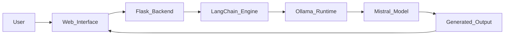
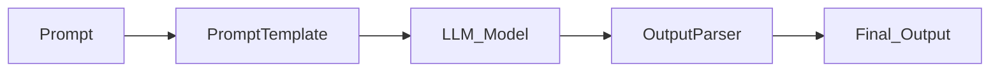

<p align="center">

</p>

<p align="center">


</p>

---

# GAMORECOM

<table>
<tr>
<td>

Gamorecom is a **Generative AI platform for game asset creation** built with modern AI engineering practices.

The project demonstrates how **local large language models** can be integrated into a **web application pipeline** to generate creative game content such as:

• fantasy creatures
• magical weapons
• quest narratives
• world lore

The system combines **LangChain orchestration**, **local LLM execution**, and a **modern UI interface** to create a compact yet powerful AI application.

</td>
</tr>
</table>

---

# Technology Stack

<p align="center">


</p>

---

# System Architecture



---

# LangChain Generation Pipeline



The pipeline demonstrates a simplified **LangChain LCEL workflow** for controlled prompt generation.

---

# Core Features

<table>
<tr>
<td width="50%">

AI Content Generation

Generate creative assets such as:

• mythical dragons
• enchanted weapons
• fantasy locations
• RPG quest lines

</td>

<td width="50%">

Local AI Execution

Runs fully on local machine using:

• Ollama runtime
• Mistral language model
• No external API costs

</td>
</tr>

<tr>
<td>

Interactive Web Interface

Modern web interface including:

• cinematic landing page
• video background
• responsive card layouts

</td>

<td>

AI Chat Interaction

Dedicated chat interface allowing:

• dynamic prompt input
• adjustable parameters
• live AI responses

</td>
</tr>

</table>

---

# Parameter Experiments

The project explores how **LLM parameters influence generated outputs**.

| Parameter        | Description                           |
| ---------------- | ------------------------------------- |
| temperature      | Controls creativity of responses      |
| seed             | Controls reproducibility of outputs   |
| prompt structure | Affects generated style and narrative |

Example experiment:

Prompt:

```
Generate a powerful dragon boss for a fantasy RPG
```

Temperature = 0.2
Output becomes more structured and predictable.

Temperature = 0.9
Output becomes more imaginative and varied.

Seed changes produce different variations of the same concept.

---

# Project Structure

```
GAMORECOM
│
├── app.py
│
├── static
│   └── css
│       └── style.css
│
├── templates
│   ├── index.html
│   └── aichat.html
│
├── uploads
│   ├── Screenshot 2026-03-05 1309.png
│   ├── Screenshot 2026-03-05 1311.png
│   ├── Screenshot 2026-03-05 1314.png
│   └── Screenshot 2026-03-05 1315.png
│
└── .vscode
```

---

# Application Workflow

<table>
<tr>
<td>

Step 1
User opens the landing page.

Step 2
User clicks **Meet Gamorecom**.

Step 3
AI chat interface opens.

Step 4
User submits a creative prompt.

Step 5
LangChain processes the prompt.

Step 6
Ollama runs the Mistral model locally.

Step 7
Generated output is returned to the interface.

</td>
</tr>
</table>

---

# API Endpoint

POST request

```
/api/generate
```

Example request

```
{
 "prompt": "generate a powerful dragon boss",
 "temperature": 0.8,
 "seed": 123
}
```

Example response

```
{
 "output": "An ancient crimson dragon named Zyphorax emerges from volcanic ruins..."
}
```

---

# Interface Preview

<p align="center">


</p>

---

# Installation

Clone repository

```
git clone https://github.com/your-username/gamorecom.git
```

Enter project directory

```
cd gamorecom
```

Install dependencies

```
pip install flask langchain
```

Install Ollama runtime

https://ollama.com

Download model

```
ollama pull mistral
```

Run application

```
python app.py
```

Open browser

```
http://localhost:5000
```

---

# Future Improvements

• 3D asset generation
• AI image generation for game textures
• Blender integration pipeline
• Asset export for Unity / Unreal Engine
• Automatic asset tagging and search

---

# Author

Debashish Parida
Computer Science Engineering

Artificial Intelligence
Data Science
Generative AI
Full Stack Development


